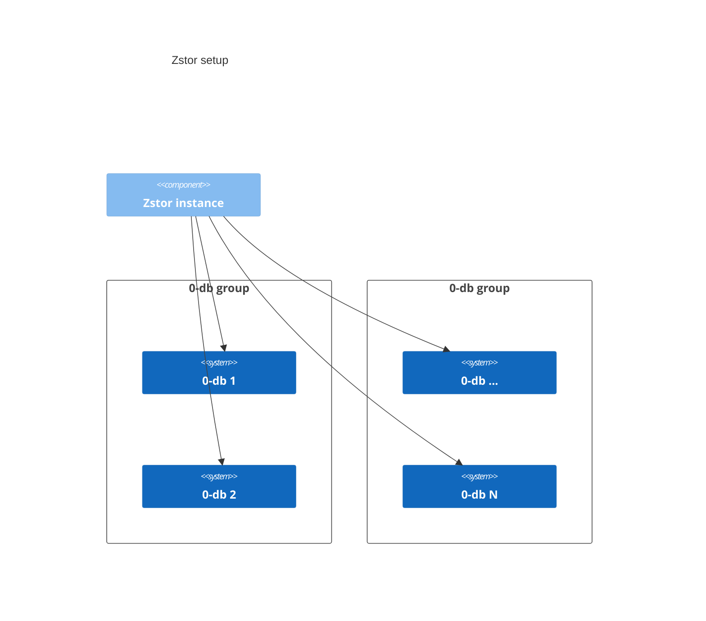

# 0-stor_v2

`zstor` is an object encoding storage system. It can be run in either a
daemon - client setup, or it can perform single actions without an
associated daemon, which is mainly useful for uploading/retrieving
single items. The daemon is part of the same binary, and will run other
useful features, such as a repair queue which periodically verifies the
integrity of objects.

## Storage and data integrity

Zstor uses 0-db's to store the data. It does so by splitting up the data in chunks and distributing them over N 0-db's.



Zstor uses forward looking error correcting codes (FLECC) for data consistency and to protect against data loss.

This means zstor constantly tries to spread the data over N, being the *expected_shards*, 0-db's.

As long as there are M (*minimal_shards*), M being smaller than N off course, chunks of data intact, zstor can recover the data.

## Expected setup

Currently, `zstor` expects a stable system to start from, which is user
provided:

- `zstor` has a redundancy configuration which introduces the notion of
 `groups`: a group is a list of 0-db's which have an inherent larger risk of going
 down together. For example, grid 0-db's which are deployed on the same farm.

## Daemon - client usage vs standalone usage

The daemon, or monitor, can be started by invoking `zstor` with the
`monitor` subcommand. This starts a long running process, and opens up a
unix socket on the path specified in the config. Regular command
invocations (example "store") of `zstor` will then read the path to the
unix socket from the config, connect to it, send the command, and wait
until the monitor daemon returns a response after executing the command.
This setup is recommended as:

- It exposes optional metrics for prometheus to scrape.
- Only a single upload/download of a file happens at once, meaning you
 won't burn out your whole cpu by sending multiple upload commands in
 quick succession.

If the socket path is not specified, `zstor` will fall back to its
single command flow, where it executes the command in process, and then
exits. Invoking `zstor` multiple times in quick succession might cause
multiple uploads to be performed at the same time, causing multiple cpu
cores to be used for the encryption/compression.

## Current features

### Supported commands

- `Store` data in multiple chunks on zdb backends, according to a given policy
- `Retrieve` said data, using just the path and the metadata store. Zdbs can be
removed, as long as sufficient are left to recover the data.
- `Rebuild` the data, loading existing data (as long as sufficient zdbs are left),
reencoding it, and storing it in (new) zdbs according to the current config
- `Check` a file, returning a 16 byte `blake2b` checksum (in hex) if it
 is present in the backend (by fetching it from the metastore).

### Other features

- Monitoring of active 0-db backends. An active backend is considered a
backend that is tracked in the config, which has sufficient space
 left to write new blocks.
- Repair queue: periodically, all 0-db's used are checked, to see if the
 are still online. If a 0-db is unreachable, all objects which have a
 chunk stored on that 0-db will be rebuild on fully healthy 0-db's.
- Prometheus metrics. The metrics server is bound to all interfaces, on
 the port specified in the config. The path is `/metrics`. If no port
 is set in the config, the metrics server won't be enabled.

## Building

Make sure you have the latest Rust stable installed. Clone the repository:

```shell
git clone https://github.com/threefoldtech/0-stor_v2
cd 0-stor_v2
```

Then build with the standard toolchain through cargo:

```shell
cargo build
```

This will produce the executable in `./target/debug/zstor_v2`.

### Static binary

On linux, a fully static binary can be compiled by using the `x86_64-unknown-linux-musl`
target, as follows:

```rust
cargo build --target x86_64-unknown-linux-musl --release
```

## Config file

Running `zstor` requires a config file. An example config, and
explanation of the parameters is found below.

### Example config file

```toml
minimal_shards = 10
expected_shards = 15
redundant_groups = 1
redundant_nodes = 1
root = "/virtualroot"
socket = "/tmp/zstor.sock"
prometheus_port = 9100
zdb_data_dir_path = "/tmp/0-db/data"
max_zdb_data_dir_size = 25600

[encryption]
algorithm = "AES"
key = "0000000000000000000000000000000000000000000000000000000000000000"

[compression]
algorithm = "snappy"

[meta]
type = "zdb"

[meta.config]
prefix = "someprefix"

[meta.config.encryption]
algorithm = "AES"
key = "0101010101010101010101010101010101010101010101010101010101010101"

[[meta.config.backends]]
address = "[2a02:1802:5e::dead:beef]:9900"
namespace = "test2"
password = "supersecretpass"

[[meta.config.backends]]
address = "[2a02:1802:5e::dead:beef]:9901"
namespace = "test2"
password = "supersecretpass"

[[meta.config.backends]]
address = "[2a02:1802:5e::dead:beef]:9902"
namespace = "test2"
password = "supersecretpass"

[[meta.config.backends]]
address = "[2a02:1802:5e::dead:beef]:9903"
namespace = "test2"
password = "supersecretpass"

[[groups]]
[[groups.backends]]
address = "[fe80::1]:9900"

[[groups.backends]]
address = "[fe80::1]:9900"
namespace = "test"

[[groups]]
[[groups.backends]]
address = "[2a02:1802:5e::dead:babe]:9900"

[[groups.backends]]
address = "[2a02:1802:5e::dead:beef]:9900"
namespace = "test2"
password = "supersecretpass"
```

### Config file explanation

- `minimal_shards`: The minimum amount of shards which are needed to recover
    the original data.
- `expected_shards`: The amount of shards which are generated when the data is
    encoded. Essentially, this is the amount of shards which is needed to be able
    to recover the data, and some disposable shards which could be lost. The
    amount of disposable shards can be calculated as
    `expected_shards - minimal_shards`.
- `redundant_groups`: The amount of groups which one should be able to
    loose while still being able to recover the original data.
- `redundant_nodes`: The amount of nodes that can be lost in every group
    while still being able to recover the original data.
- `root`: virtual root on the filesystem to use, this path will be removed
    from all files saved. If a file path is loaded, the path will be
    interpreted as relative to this directory
- `socket`: Optional path to a unix socket. This socket is required in
    case zstor needs to run in daemon mode. If this is present, zstor
    invocations will first try to connect to the socket. If it is not found,
    the command is run in-process, else it is encoded and send to the socket
    so the daemon can process it.
- `zdb_data_dir_path`: Optional path to the local 0-db data file directory.
    If set, it will be monitored and kept within the size limits. This is primarily
    used when 0-stor is running as part of a QSFS deployment. In this case, a 0-db-fs
    instance is running, which is using a local 0-db as read/write cache. When this
    option is set, the size of this cache is monitored, and if needed the least recently
    accessed files are removed.
- `max_zdb_data_dir_size`: Maximum size of the data dir in MiB, if this
    is set and the sum of the file sizes in the data dir gets higher than
    this value, the least used, already encoded file will be removed.
- `zdbfs_mountpoint`: Optional path of a 0-db-fs mount. If present, a syscall
    will be executed periodically to retrieve file system statistics, which will
    then be exposed through the build-in prometheus server.
- `prometheus_port`: An optional port on which prometheus metrics will be
    exposed. If this is not set, the metrics will not get exposed.
- `encryption`: configuration to use for the encryption stage. Currently
    only `AES` is supported. The encryption `key` is 32 random bytes in hexadecimal form.
- `compression`: configuration to use for the compression stage.
    Currently only `snappy` is supported
- `meta`: configuration for the metadata store to use, currently only
    `zdb` is supported
- `groups`: The backend groups to write the data to.

Explanation:

## Metadata

When data is encoded, metadata is generated to later retrieve this data.
The metadata is stored in 4 0-dbs, with a given prefix.

For every file, we get the full path of the file on the system, generate a 16 byte
blake2b hash, and hex encode the bytes. We then append this to the prefix to
generate the final key.

The key structure is: `/{prefix}/meta/{hashed_path_hex}`

The metadata itself is encrypted, binary encoded, and then dispersed in
the metadata 0-dbs.
